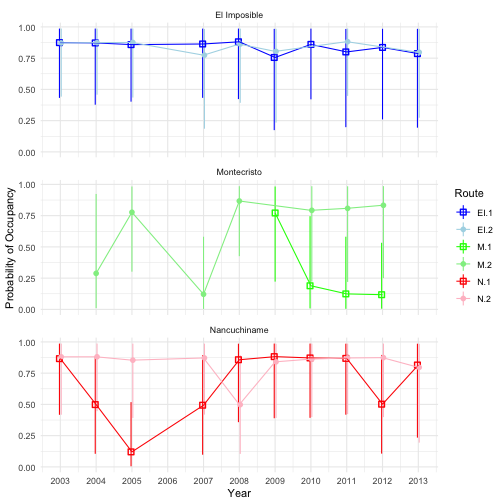
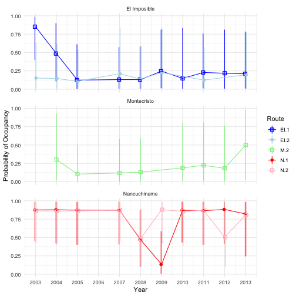
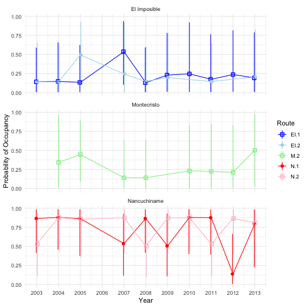

--- 
title: "working owls methods"
author: "Althea Archer"
date: "11/11/2020"
output:
  word_document:
    fig_caption: yes
  pdf_document:
    includes:
      latex_engine: pdflatex
    keep_tex: yes
csl: ecology.csl
bibliography: owl_references.bib
---

```{r setup, include=FALSE}
knitr::opts_chunk$set(echo = FALSE)
```

# Methods

*Table 1XX. Species detection records by route. Ones indicate that that species was detected during that route and year, and zeros indicated that those owls were not detected, although they may have been present and undetected. Owl surveys were conducted from 2003 to 2013 in three different protected areas within El Salvador, although specific survey years varied by route, which was given in column "Year"*


``` {r}
load("../data/output_data/richness_species_accounts_byRt.Rdata")
library(pander)
pander(species.accounts.byRt)
```


## Occupancy Model Framework

Let 

\[
\begin{aligned}
t  &=  \text{the years of surveys (here }t = 1,2,\ldots,11)\text{ corresponding with 2003-2013}\\
h  &=  \text{the individual routes (here }h = 1,2,\ldots,6)\text{ corresponding with EI1, EI2, M1, M2, N1, N2}\\
i  &=  \text{the individual surveys conducted in each year and route (here }i = 1,2,3)\\
j  &=  \text{the individual stations along each route (here }j = 1,2,\ldots,10)\\
k  &=  \text{the broadcast species (here }k = 1,2,\ldots,10)\\
z_{t,h,i} &= \text{a random variable equal to 1 when a survey was occupied and 0 otherwise}\\
y_{t,h,i,j,k} &= \text{a random variable equal to 1 when an owl was detected and 0 otherwise}
\end{aligned}
\]

We assumed that survey occupancy ($z_{t,h,i}$) was the outcome of Bernoulli trials with probability $\psi$, which we allowed to vary by year and route:

$$
z_{t,h,i} \sim \text{Bernoulli}(\psi_{t,h})
$$

$$
\psi_{t,h} \sim \text{Beta}(a^\psi_{t,h},b^\psi_{t,h})
$$
with hyperpriors for $a^\psi_{t,h}$ and $b^\psi_{t,h}$ such that the expected value of $\psi_{t,h} = \mu^\psi_{t,h}$:

\[
\begin{aligned}
\text{E}[\psi_{t,h}] &= \mu^\psi_{t,h} = a^\psi_{t,h}/(a^\psi_{t,h}+b^\psi_{t,h})\\
\rho^\psi_{t,h} &= a^\psi_{t,h}+b^\psi_{t,h}\\
\text{logit}(\mu^\psi_{t,h}) &\sim \text{N}(0, 2.25)\\
\ln(\rho^\psi_{t,h}) &\sim \text{N}(5,1)\text{, truncated to 0.01,10}\\
\end{aligned}
\]

We assumed that detecting an owl depended on an owl being present during that survey ($z_{t,h,i} = 1$) and the probability of detection, which was related to the species of owl played for broadcast ($k$):

$$
y_{t,h,i,j,k} \sim \text{Bernoulli}(z_{t,h,i}*p_{t,h,i,j,k})
$$

where, generally, $\text{logit}(p_{t,h,i,j,k}) = \beta_kX_k$, or more specifically:

\[
\begin{aligned}
\text{logit}(p_{t,h,i,j,k}) &= \beta_\text{Pre-broadcast}X_\text{Pre-broadcast} + \\
&= \beta_\text{Mottled}X_\text{Mottled}+\\
&= \beta_\text{Pacific}X_\text{Pacific}+\\
&= \beta_\text{Crested}X_\text{Crested}+\\
&= \beta_\text{Black and White}X_\text{Black and White}+\\
&= \beta_\text{Spectacled}X_\text{Spectacled}+\\
&= \beta_\text{Whiskered}X_\text{Whiskered}+\\
&= \beta_\text{Guat Barred}X_\text{Guat Barred}+\\
&= \beta_\text{Stygian}X_\text{Stygian}+\\
&= \beta_\text{Great Horned}X_\text{Great Horned}\\
\end{aligned}
\]

This model provides a consistent probability of detection for all surveys in the first two minutes of each survey before the broadcast owl recording was played ($k = \text{Pre-broadcast}$). Then, the probability of detection for each post-broadcast time period would depend on the species of broadcast owl. This allowed species-specific behavior in response to the different broadcast owl species [@Baumgardt:2019]. We used means parameterization such that the coefficients were interpretable as the effect of that specific broadcast species $k$ (including the pre-broadcast time frame). The priors for every logistic model coefficient $\beta_k$ were chosen to be near uniform as recommended in @Gelman:2008. Specifically, we used the Cauchy prior such that: $\beta_k \sim \text{Cauchy}(\text{precision} = 0.16)$.

The broadcast species were consistent at each station across years, but varied by route (Table 2XX).  Thus, the effective sample sizes of the different broadcast species varied. 

*Table 2XX. Broadcast species by route and station. Owl surveys were conducted from 2003 to 2013 in three different protected areas within El Salvador. Pre-recorded owl calls were broadcast after 2 minutes of silent listening.*

``` {r, echo = F}
load(file = "../data/output_data/broadcast_array.Rdata")
pander(broadcast.array)
```

### Occupancy Model Implementation

We used the R2jags package in R [@R:2014,@Plummer:2013] to implement the occupancy model for three owl species: Mottled, Spectacled, and FerPy owls. These owls had enough positive detections to analyze occupancy, as Mottled, Spectacled, and FerPy owls had 542, 137, and 187 positive detections over the 11 year period, respectively. Based on our understanding of owl ecology, we assumed that Spectacled and FerPy owls would not occupy route M1 in Montecristo, so we removed M1 from those species' occupancy analyses. 

For all three species' occupancy models, we ran 3 chains for 10,000 iterations and 1000 iterations discarded as burn-in, for a total of 27,000 iterations comprising the posterior distributions for each model parameter. Initial values for $z_{t,h,i}$ were equivalent to one if an owl was detected in that survey $i$ and otherwise zero. We visually inspected traceplots to verify that chains mixed well (Supplemental information S1-3xx). 

## Richness Model Framework

To model species richness at each route in each year, we assumed that there were 14 possible species present in El Salvador. This included the 10 species observed during our surveys (including unknown owl species) and an additional 4 unidentified species. This limit to species richness relates directly to the 13 species known to inhabit El Salvador (cite Owls of El Salvador here) plus one species we identified (Stygian owl), which was previously undocumented in El Salvador. We augmented our owl detection data with 4 additional potential species with all-zero detection [@Royle:2007]. For each species $s$ (where $s = 1,2, \ldots,14$), $w_{t,h,s}$ was a binary indicator of that owl species being present in each route and year:

$$
w_{t,h,s} \sim \text{Bernoulli}(\Omega_h)
$$
where $\Omega_h$ was the probability of species presence in each route $h$. In the richness model, the presence of an owl species in any route, year, and survey, $z_{t,h,i,s}$, was conditional on the probability of occupancy for that route, year, and species $\psi_{t,h,s}$ *and* that species belonging to that route's community ($w_{t,h,s}$):

$$
z_{t,h,i,s} \sim \text{Bernoulli}(w_{t,h,s}*\psi_{t,h,s})
$$

Richness was conditional on each species presence and was estimated as the sum of owl species present in each route and year:

$$
\text{Richness}_{t,h} = \sum_{s=1}^{14} w_{t,h,s} 
$$

To share information about occupancy amongst species, we incorporated random effects into the parameterization of $\psi_{t,h,s}$:

\[
\begin{aligned}
\psi_{t,h,s} &\sim \text{Beta}(a^\psi_{t,h,s},b^\psi_{t,h,s})\\ 
a^\psi_{t,h,s} &= \mu^\psi_{t,h}\rho^\psi\\
b^\psi_{t,h,s} &= \rho^\psi - \mu^\psi_{t,h}\rho^\psi\\
\text{logit}(\mu^\psi_{t,h}) &= \text{E}(\psi_{t,h,s}) \sim N(0,2.25)\\
\ln(\rho^\psi) &\sim N(5,1)\text{, truncated to (0.01,10)}\\
\end{aligned}
\]

This parameterization allowed us to borrow strength across species in determining the mean probability of occupancy ($\mu^\psi_{t,h}$) for each route and year [@Guillera-Arroita:2019].

Consistent with our approach for the occupancy models, we assumed that detecting an owl depended on an owl of that species being present during that survey ($z_{t,h,i,s} = 1$) and the probability of detection $p_{t,h,i,j,k,s}$, which was related to the broadcast species:

$$
y_{t,h,i,j,k,s} \sim \text{Bernoulli}(z_{t,h,i,s}*p_{t,h,i,j,k,s})
$$

where generally $\text{logit}(p_{t,h,i,j,k,s}) = \beta_kX_k$ for each broadcast species $k$ as described above. The coefficients of the detection model were thus assumed to be consistent for all owl species, which allowed us to borrow information about the detection process for undetected owls from those that were detected.

### Richness Model Implementation

We used the R2jags package in R [@R:2014,@Plummer:2013] to implement the richness model. 
We ran 3 chains for 20,000 iterations and 2000 iterations discarded as burn-in and a thinning rate of 2, for a total of 27,000 iterations comprising the posterior distributions for each model parameter. Initial values for $z_{t,h,i,s}$ were equivalent to one if that species of owl $s$ was detected in that survey $i$ and otherwise zero. Similarly, initial values for $w_{t,h,s}$ were equivalent to one if that species of owl was detected in that route and year and otherwise zero. We visually inspected traceplots to verify that chains mixed well (Supplemental information S4xx). 

# Results

## Occupancy Model Results

Averaged across years, we found that the probability of occupancy was somewhat higher for Mottled owls than for FerPy or Spectacled owls in both routes of El Imposible and in M2 route of Montecristo (Fig. 1X). The probability of occupancy across all three species and both routes of Nancuchiname were relatively high (Fig. 1XX). We found that the probability of occupancy for Mottled owls was relatively consistent across time in El Imposible and in N2 route (Fig. 2XX), but that it seemed to increase in the last 6 or so years of the surveys in M2 and N1 routes (Fig. 2XX). The probability of occupancy in M1 seemed to have decreased through time for Mottled owls (Fig. 2XX). 

The probability of occupancy for FerPy and Spectacled stayed relatively consistently low across time in routes EI1, EI2, and M2 other than a higher probability of occupancy for FerPy in EI1 in the early years of the surveys (Figs. 3XX and 4XX). FerPy probability of occupancy was relatively high in both routes of Nancuchaname except in 2008 and 2009 (Fig. 3XX), and the probability of occupancy for the Spectacled owl slightly fluctuated year to year in the Nancuchaname routes (Fig. 4XX). 


## Richness Model Results

Median species richness varied from 1 to 5, depending on route and year (Fig. 5XXX). At most, the median species richness was one species higher than the number of species detected at any single route and year; however, the 90% credible intervals of richness added up to 4 new undetected species in several years of EI1 surveys and two years of M2 surveys (Fig. 5XXX). The shared information through random effects by route tended to smooth out the year-to-year variation in predicted richness, which in a few instances meant that the median predicted richness was less than the number of observed species in that route and year (Fig. 5XXX)

## Detection Results

Adding in all detected species to one richness model increased the precision of the estimates of the effect of broadcast species on detection probability (i.e., compare All Species with individual occupancy results in Fig. 6XXX). When incorporating all owl species, broadcasting calls from Mottled, Pacific, Crested, Black and White, and Spectacled Owls increased detection probability; whereas broadcasting the Great Horned owl calls decreased detection (Fig. 6XXX). 

The probability of detection when predicted through independent occupancy analyses varied little during the timeframe before broadcast recordings were played (Pre-broadcast); however, the probability of detecting owls after broadcast species were called varied by broadcast species and between Mottled, FerPy, and Spectacled owls (Fig. 6XX). The probability of detecting Mottled Owls increased after broadcasting Mottled, Pacific, Crested, Black and White, or Spectacled owls. The probability of detecting FerPy owls increased after broadcasting Mottled and Pacific owl calls, and the probability of detecting Spectacled owls increased after broadcasting Pacific, Black and White, and Spectacled owls (Fig. 6XX).

# Figures










# References