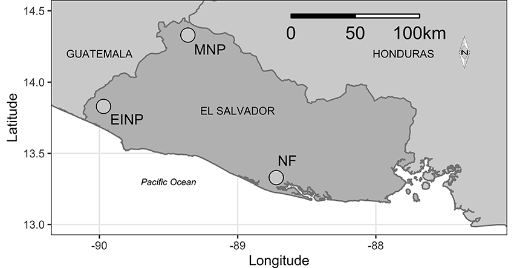

--- 
title: "Owl Occupancy in Three of El Salvador's Protected Areas from 2003 through 2013"
author: "Jane West and Althea Archer"
date: "2/27/2021"
output:
  word_document:
    fig_caption: yes
    reference_docx: theme.docx
  pdf_document:
    includes:
      latex_engine: pdflatex
    keep_tex: yes
csl: ecology.csl
bibliography: owl_references.bib
---

```{r setup, include=FALSE}
knitr::opts_chunk$set(echo = FALSE)
```


# Abstract

# Introduction


As apex predators, owls are an important bioindicator of ecosystem health, though much of our understanding comes from temperate systems [@White:2013; @Wan:2018; @Buechley:2019]. The Neotropics were recently identified as a priority area for owl research because the high conservation risk for neotropical owls has not been supported by enough research attention [@Buechley:2019], but in tropical rain and cloud forests, owl studies are much more difficult than in temperate regions, regardless of potentially denser populations [@Konig:1999]. As a result, we have limited understanding of neotropical owls’ distribution, ecological requirements, population dynamics, and reproductive behavior [@Clark:1978; @Enriquez:2006; @Perez-Leon:2017; @Rangel-Salazar:2017]. This lack of information poses a challenge for proactive conservation, even as neotropical habitat experiences tremendous anthropogenic pressure and rapid, unpredictable responses to climate change [@Corlett:2012]. In general, while our knowledge about the status and trends of neotropical owl populations is limited, we do know that owl abundance and distribution is decreasing in several regions where species have been added to endangered species lists or have become locally extirpated [@Enriquez:2006].

El Salvador is located on the western side of the Central American isthmus and is the smallest and most densely populated Central American country [Fig. 1; @CIA:2020]. Overall, 13.6% of El Salvador's 20,720 km$^2$ of land is forested, and 82% is used for agricultural purposes [@CIA:2020]. A common agroecosystem in El Salvador is shade-grown coffee, which supports forested cover on otherwise agricultural land. Approximately 7% of El Salvador's forested land is comprised of shade-grown coffee, which may be providing an important land-use buffer around El Salvador's protected natural areas [@Silva:2016; @Perez-Leon:2017]. Although shade-grown coffee systems are potentially reducing the impacts of land-use and climate change on the forest-dependent owls of El Salvador [e.g., @Perez-Leon:2017], there is a lack of information about the long-term  dynamics of these populations. Concerns about habitat availability are not the only challenge facing El Salvador's owls. @Perez-Leon:2017 stated that there are human activities affecting owl populations in El Salvador, including illegal hunting, trapping, persecution, killing, and wildlife trade. 


The objective of our study was to collect occupancy data on El Salvador owls through time to determine both the population dynamics of individual owl species and the overall community composition of owls in three targeted protected areas, El Imposible National Park, Montecristo National Park, and Nancuchiname Forest. El Salvador is located in the heart of the Mesoamerican Biodiversity Hotspot [@Myers:2000], and we selected three survey areas in protected landscapes to represent the breadth of ecosystem diversity across the country. We set up two routes in each protected area and conducted nighttime foot surveys using passive listening and broadcast calls during the breeding season for three weeks during each year from 2003 through 2013.


# Methods

## Study area

We conducted surveys in three protected natural areas in El Salvador (El Imposible National Park, Montecristo National Park, and Nancuchiname Forest) located at different elevations (high, mid and low elevations) and in different types of forest vegetation (alluvial, deciduous, semi-deciduous, pine-oak and cloud forest) that represent a portion of the country's diverse ecosystems (Fig. 1, Table 1). El Imposible National Park (NP) was located 119 km southwest of San Salvador (Fig. 1; Table 1).  Its elevation ranged from 250 to 1425 m above sea level (a.s.l.).  It was the largest NP in the country, covering 3792 ha, and its elevation ranged from 250 to 1425 m a.s.l..  The topography of El Imposible was extremely steep and broken, with many cliffs [@Alvarez:2003].  The area contained deciduous and semi-deciduous forest, secondary growth vegetation on the edges, and former pasture areas that were reforested with native species in 1997.  We established one survey route (EI-1) in the western portion of El Imposible in an area of reforestation and at a low elevation and a second survey route (EI-2) in an area of semi-deciduous forest.

Montecristo NP (1973 ha) was located 125 km northwest of San Salvador (Fig. 1; Table 1).  Its altitude ranged from 730 to 2418 m a.s.l. [@MARN:2010]. High elevations of Montecristo contained cloud forest, middle elevations contained pine/oak forest (with some pine and cypress plantations) and the lower elevations contained a semi-deciduous tropical forest [@MARN:2015b].  This NP was part of the Montecristo Tri-national Protected Area which included extensive adjoining natural areas in Guatemala and Honduras [@Komar:2010].  Within Montecristo, we established one survey route (M-1) in a cloud forest and another (M-2) at a moderate elevation in a pine/oak forest.

Nancuchiname Forest (797 ha) was a Protected Natural Area located 95 km southeast of San Salvador in the coastal alluvial plain along the Lempa River (Fig. 1; Table 1).  Its elevation ranged from sea level to 12 m a.s.l.  The area contained deciduous and semi-deciduous forest, second growth vegetation, native species reforestation and a dike surrounded by secondary growth.  In Nancuchiname Forest, we established one survey route (N-1) in alluvial forest along the dike and the other route (N-2) in a semi-deciduous alluvial forest.


*Table 1. Route locations and habitats. Owl surveys were conducted from 2003 to 2013 in three different protected areas within El Salvador: El Imposible National Park (EI-1 and EI-2), Montecristo National Park (M-1 and M-2), and Nancuchiname Forest (N-1 and N-2). *

```{r}
library(pander)
Habitat <- c("Reforested deciduous forest",
             "Semi-deciduous forest",
             "Cloud forest",
             "Pine/oak forest",
             "Alluvial forest with secondary growth",
             "Alluvial forest")
Latitude <- c("13xx 50.75'", "13xx 51.38'", 
              "14xx 24.88'", "14xx 23.19'", 
              "13xx 19.95'", "13xx 22.03'")
Longitude <- c("89xx 59.74'", "89xx 58.24'", 
               "89xx 21.63'", "89xx 22.33'", 
               "88xx 43.63'", "88xx 43.30'")
Elevation <- c("609", "958", "2111", "1755", "3", "2")
Route <- c("EI-1", "EI-2", "M-1", "M-2", "N-1", "N-2")
Area <- c("El Imposible", "NP", 
          "Montecristo", "NP", "Nancuchiname", "Forest")
#parkTable <- as.data.frame(matrix(
#  c(NamePark, NameRoute, Latitude, Longitude, Habitat), byrow = T, nrow = 5, ncol = 7))
parkTable <- data.frame(Route, Latitude, Longitude, Elevation, Habitat)
pander(parkTable)

```

## Survey methods


We conducted acoustic surveys on foot following the Guidelines for Nocturnal Owl Monitoring [@Takats:2001], a similar protocol developed for Costa Rica [@Enriquez:2001], and other raptor research guidelines [@Fuller:1987]. This study's survey protocol was an extension of previous research completed in the western half of El Imposible NP [@West:1988].  We created six 2-km long survey routes (transects) that each included 10 permanent survey stations set at 200 m intervals. Two routes were established in each protected area (Table 1). 

Surveys began at local twilight and took approximately five hours to complete.  At each station, we measured and recorded environmental conditions (Brunton Sherpa, Brunton Incorporated) including temperature, precipitation, cloud cover, fog cover, wind speed, barometric pressure, moon phase, and noise level. The acoustic survey then began with passive listening for two minutes, followed by a three-minute broadcast call, and ending with seven minutes of silent listening. We recorded local owl vocalizations and used them for broadcast calls whenever possible. If an owl vocalized during broadcast playback, we stopped the broadcast and recorded the owl's vocalization. When we detected an owl, we noted its  location and bearing relative to the station, and we tracked when the same owl was identified at consecutive stations. 

The broadcast calls varied between routes, but were consistent at each route and station across years. Specifically, we broadcast the vocalizations of Pacific Screech-Owls (*Megascops cooperi*), Mottled Owls (*Ciccaba virgata*), Crested Owls (*Lophostrix cristata*), Black-and-white Owls (*C. nigrolineata*), Spectacled Owls (*Pulsatrix perspicillata*), Pacific Screech-Owls, Mottled Owls, Crested Owls, Black-and-white Owls, and Spectacled Owls at stations 1 through 10, respectively, in all routes in El Imposible NP (EI-1 and EI-2) and Nancuchiname Forest (N-1 and N-2). We broadcast the vocalizations of Whiskered Owls (*M. trichopsis*), Mottled Owls, Fulvous Owls (*Strix fulvescens*), Stygian Owls (*Asio stygius*), Great Horned Owls (*Bubo virginianus*), Whiskered Owls, Mottled Owls, Fulvous Owls, Stygian Owls, and Great Horned Owls at stations 1 through 10, respectively, in both routes of Montecristo NP (M-1 and M-2). We used locally-recorded owl vocalizations for our broadcast surveys when possible, because @Gerhardt:1989 found that a series of Mottled Owl vocalizations obtained from a non-local ornithological laboratory could not generate a response from Guatemalan owls. 

Surveys were repeated at each route up to three times a year from 2003 through 2013, depending on site access and weather. We did not conduct any surveys in 2006. We georeferenced the owl detections for each survey and route to eliminate double counting of individual owl observations.


*Table 2. Species detection records by route. Owl surveys were conducted from 2003 to 2013 in three different protected areas within El Salvador, although specific survey years varied by route.*


``` {r}
load("../data/output_data/richness_species_accounts_byRt.Rdata")
library(pander)
updated <- species.counts.long[,c(3:9)]
updated$Common[updated$Common == "Lophostrix cristata"] <- "Crested"
scientific <- species.counts.long[,c(2,4:9)]
scientific[,c(2:7)] <- " "
colnames(updated) <- names(scientific) <- c("NameBoth", "EI-1", "EI-2",
                                            "M-1", "M-2", "N-1", "N-2")

combo <- rbind(updated, scientific)


combo$Name <- factor(x = combo$NameBoth,
                           levels = c("Barn", "Tyto alba",
                                      "Whiskered Screech", "M. trichopsis",
                                      "Pacific Screech", "Megascops cooperi",
                                      "Crested", "Lophostrix cristata",
                                      "Spectacled", "Pulsatrix perspicillata",
                                      "Great Horned", "Bubo virginianus",
                                      "Ferruginous Pygmy", "Glaucidium brasilianum",
                                      "Burrowing", "Athene cunicularia",
                                      "Mottled", "Ciccaba virgata",
                                      "Black-and-white", "Ciccaba nigrolineata",
                                      "Fulvous", "Strix fulvescens",
                                      "Stygian", "Asio stygius",
                                      "Striped", "Pseudoscops clamator",
                                      "Unspotted Saw-whet", "Aegolius ridgwayi"),
                           labels = c("Barn Owl", "(Tyto alba)",
                                      "Whiskered Screech-Owl", "(Megascops trichopsis)",
                                      "Pacific Screech-Owl", "(Megascops cooperi)",
                                      "Crested Owl", "(Lophostrix cristata)",
                                      "Spectacled Owl**", "(Pulsatrix perspicillata)",
                                      "Great Horned Owl", "(Bubo virginianus)",
                                      "Ferruginous Pygmy-Owl", "(Glaucidium brasilianum)",
                                      "Burrowing Owl", "(Athene cunicularia)",
                                      "Mottled Owl", "(Ciccaba virgata)",
                                      "Black-and-white Owl**", "(Ciccaba nigrolineata)",
                                      "Fulvous Owl*", "(Strix fulvescens)",
                                      "c.f. Stygian Owl", "(Asio stygius)",
                                      "Striped Owl", "(Pseudoscops clamator)",
                                      "Unspotted Saw-whet Owl", "(Aegolius ridgwayi)"
                           ))

row.names(combo) <- NULL
final <- combo[order(combo$Name),c(8,2:7)]
row.names(final) <- NULL
pander(final)
```
*Note: \*\* = Endangered and \* = Threatened [@MARN:2015]*

## Single-species occupancy model framework

We modeled occupancy within each route, year, and survey assuming that the probability of occupancy would be closed across surveys of a given route in a given year. In other words, for any single species of owl, we assumed that the probability of a route being occupied would not change between surveys within a year but could vary between years. Let:

\[
\begin{aligned}
t  &=  \text{the year each survey was conducted (}t = 1,2,\ldots,11)\text{ representing 2003-2013}\\
h  &=  \text{the individual route (}h = 1,2,\ldots,6)\text{ representing EI-1, EI-2, M-1, M-2, N-1, N-2}\\
i  &=  \text{the individual surveys conducted in each year and route (}i = 1,2,3)\\
j  &=  \text{the individual stations along each route (}j = 1,2,\ldots,10)\\
k  &=  \text{the broadcast call species (}k = 1,2,\ldots,10)\\
z_{t,h,i} &= \text{a random variable equal to 1 when a survey route was occupied and 0 otherwise}\\
y_{t,h,i,j,k} &= \text{a random variable equal to 1 when an owl was detected and 0 otherwise}
\end{aligned}
\]

We assumed that occupancy in each individual survey ($z_{t,h,i}$) was the outcome of Bernoulli trials with a probability of occupancy, $\psi_{t,h}$, which we allowed to vary by year and route:

$$
z_{t,h,i} \sim \text{Bernoulli}(\psi_{t,h})
$$

$$
\psi_{t,h} \sim \text{Beta}(a^\psi_{t,h},b^\psi_{t,h})
$$
with hyperpriors for $a^\psi_{t,h}$ and $b^\psi_{t,h}$ such that the expected value of $\psi_{t,h} = \mu^\psi_{t,h}$:

\[
\begin{aligned}
\text{E}[\psi_{t,h}] &= \mu^\psi_{t,h} = a^\psi_{t,h}/(a^\psi_{t,h}+b^\psi_{t,h})\\
\rho^\psi_{t,h} &= a^\psi_{t,h}+b^\psi_{t,h}\\
\text{logit}(\mu^\psi_{t,h}) &\sim \text{N}(0, 2.25)\\
\ln(\rho^\psi_{t,h}) &\sim \text{N}(5,1)\text{, truncated to 0.01,10}\\
\end{aligned}
\]


We assumed that detecting an owl depended on an owl being present during that survey ($z_{t,h,i} = 1$) and the probability of detection, $p_{t,h,i,j,k}$, which was related to the species-specific broadcast call ($k$):

$$
y_{t,h,i,j,k} \sim \text{Bernoulli}(z_{t,h,i}*p_{t,h,i,j,k})
$$

where, generally, $\text{logit}(p_{t,h,i,j,k}) = \beta_kX_k$, or more specifically:

\[
\begin{aligned}
\text{logit}(p_{t,h,i,j,k}) &= \beta_\text{Pre-broadcast}X_\text{Pre-broadcast} + \\
&= \beta_\text{Mottled}X_\text{Mottled}+\\
&= \beta_\text{Pacific}X_\text{Pacific}+\\
&= \beta_\text{Crested}X_\text{Crested}+\\
&= \beta_\text{Black and White}X_\text{Black and White}+\\
&= \beta_\text{Spectacled}X_\text{Spectacled}+\\
&= \beta_\text{Whiskered}X_\text{Whiskered}+\\
&= \beta_\text{Guat Barred}X_\text{Guat Barred}+\\
&= \beta_\text{Stygian}X_\text{Stygian}+\\
&= \beta_\text{Great Horned}X_\text{Great Horned}\\
\end{aligned}
\]

This model provided a consistent probability of detection for all surveys in the first two minutes of each observation period, before the broadcast call was played ($k = \text{Pre-broadcast}$). Then, the probability of detection for each post-broadcast time period depended which call had been played. This allowed species-specific behavior in response to the different broadcast calls [@Baumgardt:2019]. We used means parameterization for the logistic regression model such that the coefficients were interpretable as the effect of that specific broadcast call $k$ (including the pre-broadcast time frame). The priors for every logistic model coefficient $\beta_k$ were chosen to be near uniform as recommended in @Gelman:2008: $\beta_k \sim \text{Cauchy}(\text{precision} = 0.16)$.


## Richness model framework

To model species richness at each route in each year, we assumed that there were 14 possible species present in El Salvador. This included the 9 species observed during our surveys and an additional 5 species that we never observed (Table 2). This upper limit to expected species richness related directly to the 13 species known to inhabit El Salvador [@Dickey:1938] plus one species we identified (c.f. Stygian owl), which was previously undocumented in El Salvador. We thus augmented our owl detection data with 5 additional potential species with all-zero detection records [@Royle:2007]. 

For each species $s$ (where $s = 1,2, \ldots,15$), $w_{h,s}$ was a binary indicator of whether that owl species was present in each route based on the probability of species presence in that route, $\Omega_h$ [@Broms:2016]:

$$
w_{h,s} \sim \text{Bernoulli}(\Omega_h)
$$
We used prior distributions for $\Omega_h$: $\Omega_h \sim \text{Beta}(0.001, 1)$ [@Broms:2016; @Guillera-Arroita:2019].

In the richness model, the presence of an owl species in any year, route, and survey, $z_{t,h,i,s}$, was conditional on the probability of occupancy for that route, year, and species $\psi_{t,h,s}$ *and* that species belonging to that route's community that year ($w_{h,s}$):

$$
z_{t,h,i,s} \sim \text{Bernoulli}(w_{h,s}*\psi_{t,h,s})
$$


To share information about occupancy amongst species, we incorporated random effects into the parameterization of $\psi_{t,h,s}$:

\[
\begin{aligned}
\psi_{t,h,s} &\sim \text{Beta}(a^\psi_{t,h,s},b^\psi_{t,h,s})\\ 
a^\psi_{t,h,s} &= \mu^\psi_{t,h}\rho^\psi\\
b^\psi_{t,h,s} &= \rho^\psi - \mu^\psi_{t,h}\rho^\psi\\
\text{logit}(\mu^\psi_{t,h}) &\sim N(0,2.25)\\
\ln(\rho^\psi) &\sim N(5,1)\text{, truncated to (0.01,10)}\\
\end{aligned}
\]

This parameterization allowed us to borrow strength across species in determining the mean probability of occupancy ($\mu^\psi_{t,h}$) for each route and year [@Guillera-Arroita:2019].

Richness of each route was conditional on each species' presence and was estimated as the sum of owl species present in that route:

$$
\text{Richness}_{h} = \sum_{s=1}^{15} w_{h,s} 
$$

We also estimated year-to-year richness ($\text{Richness}^*_{t,h}$) by route by adding up the number of unique species that were present in each route, year, and survey. We first determined if a species was present in any of that route and year's set of surveys with a species-specific binary indicator $\vartheta_{t,h,s}$ where $\vartheta_{t,h,s} = 1$ if $z_{t,h,i,s} = 1$ in any of that route's surveys $i$ that year. Then, we summed up the number of species present in each year and route:
$$
\text{Richness}^*_{t,h} = \sum_{s=1}^{15} \vartheta_{t,h,s} 
$$

Consistent with our approach for the occupancy models, we assumed that detecting an owl depended on an individual of that species being present during that survey ($z_{t,h,i,s} = 1$) and the species-specific probability of detection $p_{t,h,i,j,k,s}$, which was related to the broadcast call:

$$
y_{t,h,i,j,k,s} \sim \text{Bernoulli}(z_{t,h,i,s}*p_{t,h,i,j,k,s})
$$

where generally $\text{logit}(p_{t,h,i,j,k,s}) = \beta_kX_k$ for each broadcast call $k$ as described above. The coefficients of the detection model were thus assumed to be consistent for all owl species, which allowed us to borrow information about the detection process for undetected owl species from those that were detected.

### Model implementation

We used the R2jags package in R [@R:2014] [@Plummer:2013] to implement the Bayesian models. We verified that R-hats were lower than 1.3 and visually inspected traceplots to verify that chains mixed well (Supplemental information S1xx). 

We applied the single-species occupancy model for three owl species that had sufficient positive detections for analysis: Mottled Owl, Spectacled Owl, and Ferruginous Pygmy-Owl (Table 2). Based on our understanding of owl ecology, we assumed that Spectacled and Ferruginous Pygmy owls would not occupy route M-1 in Montecristo, so we removed M-1 from those species' occupancy analyses. For all three of the single-species occupancy models, we ran 3 chains for 10,000 iterations and 1000 iterations discarded as burn-in, for a total of 27,000 iterations comprising the posterior distributions for each model parameter. Initial values for $z_{t,h,i}$ were equivalent to one if an owl was detected in that survey $i$ and otherwise zero. 

To implement the richness model, we ran 3 chains for 20,000 iterations with 2000 iterations discarded as burn-in and a thinning rate of 2, for a total of 27,000 iterations comprising the posterior distributions for each model parameter. Initial values for $z_{t,h,i,s}$ were equivalent to one if that species of owl was detected in that survey and otherwise zero. Similarly, initial values for whether a species belonged to a route's community ($w_{h,s}$) were equivalent to one if that species of owl was ever detected in that route and otherwise zero. 

# Results

A total of 86 surveys were conducted between March and May from 2003 through 2005 and 2007 through 2013. No surveys were conducted in 2006. 

We detected nine species of owls during our surveys: Barn Owl, Whiskered Screech-Owl, Pacific Screech-Owl, Spectacled Owl, Great Horned Owl, Ferruginous Pygmy-Owl, Mottled Owl, Fulvous Owl, and c.f. Stygian Owl (Table 2).  We identified Whiskered Screech-Owls in Montecristo NP, which had previously been undocumented in that protected area.  We also identified a c.f. Stygian Owl in Montecristo NP, which was a species not previously documented in the entire country of El Salvador.  The c.f. Stygian Owl requires further investigation to determine true presence of that owl in El Salvador.

## Single-species occupancy model results

Mottled Owls, Spectacled Owls, and Ferruginous Pygmy-Owls had 542, 137, and 187 positive detections over the 11 year period, respectively (Table 2). No other owl species had enough detections to analyze species-specific occupancy. Averaged across years, we found that the probability of occupancy was somewhat higher for Mottled Owls than for Ferruginous Pygmy-Owls or Spectacled Owls in both routes of El Imposible and in M-2 route of Montecristo (Fig. 1). Occupancy probabilities were relatively high across all three species for both routes of Nancuchiname (Fig. 2). We found that the probability of occupancy for Mottled Owls was relatively consistent across time in both El Imposible routes and in N-2 (Fig. 3), but that it seemed to increase in the last approximately 6 years in M-2 and N-1 (Fig. 3). The probability of occupancy in M-1 seemed to have decreased through time for Mottled Owls (Fig. 3). 

For routes EI-1, EI-2, and M-2, the probability of occupancy for Ferruginous Pygmy-Owls and Spectacled Owls stayed relatively low across time other than a higher probability of occupancy for Ferruginous Pygmy-Owl in EI-1 in the early years of the surveys (Fig. 3). The probability of occupancy for Ferruginous Pygmy-Owls was relatively high in both routes of Nancuchaname except in 2008 and 2009 (Fig. 3), and the probability of occupancy for the Spectacled Owl fluctuated slightly from year to year in the Nancuchaname routes (Fig. 3). 


## Richness model results

Our estimates of each route's community richness ($\text{Richness}_{h}$) and 90% credible intervals were 4 (4,4), 3 (3,3), 3 (3,4), 4 (4,5), 5 (5,5), and 5 (5,5) for EI-1, EI-2, M-1, M-2, N-1, and N-2, respectively. These median values were equivalent to the number of species detected in each route (Table 2), indicating that the probability of occupancy for undetected species was low and no additional species were predicted to be present in a route's community, other than those that were detected. 

When analyzed by year and route, median species richness ($\text{Richness}^*_{t,h}$) varied from 0 to 5 (Fig. 4). At most, the median species richness was one species higher than the number of species detected at any single route and year; however, the 90% credible intervals of richness added up to 4 new undetected species (e.g., in M-2 during 2004 where we detected zero species; Fig. 4).

## Detection results

Including all detected species in one richness model increased the precision of the estimates of the effect of broadcast calls on detection probability (i.e., compare All Species with individual occupancy results in Fig. 5). When incorporating all owl species, broadcasting calls from Mottled Owls, Pacific Screech-Owls, Crested Owls, Black-and-white Owls, and Spectacled Owls increased detection probability; whereas broadcasting the Great Horned Owl calls decreased detection (Fig. 5). 

The probability of detection when analyzed with single-species occupancy models varied little during the timeframe before broadcast recordings were played (Pre-broadcast); however, the probability of detecting owls after broadcast calls were played varied by call and between Mottled Owls, Ferruginous Pygmy-Owls, and Spectacled Owls (Fig. 5). The probability of detecting Mottled Owls increased after broadcasting Mottled Owl, Pacific Screech-Owl, Crested Owl, Black-and-white Owl, or Spectacled Owl calls. The probability of detecting Ferruginous Pygmy-Owls increased after broadcasting Mottled Owl and Pacific Owl calls, and the probability of detecting Spectacled Owls increased after broadcasting Pacific Screech-Owl, Black-and-white Owl, and Spectacled Owl calls (Fig. 5).

# Discussion

The goal of this project was to gather baseline data on owl abundance, distribution, and population trends in El Salvador. We established survey routes within three protected natural areas in disparate ecological regions (alluvial plain, forested, cloud forests) and attempted to complete two surveys passes per route each year from 2003 through 2013. Our surveys were not always completed twice per year in each route because of isses with site access or poor weather, which decreases owl vocalizations and detection [@Takats:2001; @Andersen:2007]. Overall, our surveys yielded sufficient data to analyze occupancy patters for three species of interest; the Mottled Owl, Ferruginous Pygmy-Owl, and Spectacled Owl.

Mottled Owls were the most frequently detected owl during our surveys. Mottled Owls are the most common and widespread owl in South America [@Vallely:2018], and they have been documented in a wide range of habitat types and elevations in Mexico [@Enriquez-Rocha:1993]. A recent study indicated that Mottled Owl populations in El Salvador have persisted despite habitat loss that has restricted the distribution of several other owl species [@Perez-Leon:2017]. In contrast, @Enriquez:2001 stated that Mottled Owl populations in La Selva may have decreased during the past 30 years.  Our results indicated that Mottled Owls are still relatively common at each of our study areas, although there seemed to be a downward trend in occupancy in M-2 that could warrant further monitoring.  

Ferruginous Pygmy-Owls were the second most-often detected owls in this study. This species demonstrated fairly low occupancy rates in El Imposible routes, other than in the first two years in EI-1. Ferruginous Pygmy-Owls tend to prefer open habitats with a lot of edge, such as the flooded $\text{igap\'o}$ forests of Amazonia [@Borges:2004] and heterogenous forests in central Argentina [@Campioni:2013]. Further, the dietary composition of Ferruginous Pygmy-Owls varies based on forest density [@Sarasola:2014]. Lower elevation areas of El Imposible were grazed and dotted with houses in the late 1980s [@West:1988], and this mixed agrarian landscape may have provided suitable habitat which has been reduced by subsequent reforestation efforts that began in 1997. It is possible that Ferruginous Pygmy-Owls are responding to a decrease in edge habitat within El Salvador, and we recommend further surveys to determine the risk to Ferruginous Pygmy-Owls in response to revegetation management. Poaching may also be a risk for these owls: of eight species of owls confiscated from local markets in 1995 to 2008, the most frequent were Mottled Owls and Ferruginous Pygmy-Owls [@Perez-Leon:2017]. 


Spectacled Owls followed similar occupancy patterns to that of the Ferruginous Pygmy-Owls, with highest levels of occupancy in the alluvial Nancuchiname Forest. Spectacled Owls can be found in a range of habitats including coffee plantations and urban parks [@Marin-Gomez:2017], and they tend to prefer lowland habitats below 1000 m a.s.l. [@Enriquez-Rocha:1993; @Orihuela-Torres:2018].  Spectacled owls were detected in each of the routes located at low to moderate elevation; however, we also detected Spectacled Owls in Montecristo National Park, transect M-2 (1755 m a.s.l.), which is potentially near the maximum of their elevation tolerance range. Spectacled Owls have been reported to prefer mammalian prey over reptilian or arthropods [@Orihuela-Torres:2018] and preferentially hunt near fallen logs where small mammals often seek refuge [@Esclarski:2014], but we were unable to test for micro-habitat occupancy in our present study. Further refinement over Spectacled Owl habitat selection could be explored in the future to better understand their ecology and distribution in the Neotropics, and specifically, El Salvador. 


Nancuchiname Forest was the richest in diversity of our three protected areas; however, many of the habitat specialist species were only detected in Montecristo NP (e.g., Whiskered Owl, Great Horned Owl, Fulvous Owl, and c.f. Stygian Owl). Fulvous Owl is one of El Salvador's 18 endemic bird species [@Komar:2002], and it was detected numerous times in the cloud forest of Montecristo NP (M-1). A Fulvous Owl has also been recently photographed in Montecristo NP [@Gonzalez:2017]. 

Stygian Owl, which often inhabit dense cloud forests [@Enriquez-Rocha:1993], were listed as an owl species expected to reside in El Salvador [@Perez-Leon:2017], but has been previously undetected in the country. On 26 March 2002, after listening to recordings and viewing photographs, the Montecristo NP guards stated that they thought c.f. Stygian owl was present in the park (personal communication). While there was only one c.f. Stygian Owl detected on our survey routes, we did also hear a c.f. Stygian Owl between the survey stations on 25 April XXXXyear. We also heard c.f. Stygian Owl vocalizations twice on M-2 between station points on 20 March 2005 and once between stations in 2007. We did not record any of these vocalizations by c.f. Stygian Owls, and detections that occurred between stations or away from survey routes were not included in our results. So while we are confident that c.f. Stygian Owls are present in Montecristo NP, we believe that further documentation of the species would be beneficial for confirmation of the species in El Salvador. 

During 1979-1981, in the western portion of El Imposible NP, West (1988) heard or observed six owl species, including two that were not detected during this study in El Imposible (Barn Owls and Black-and-white Owls). Barn Owls have been detected in a cave of Loma de Paja Mountain, which was opposite this study's El Imposible routes (Vidal Campos Aguirre, personal communication). Vidal Campos Aguirre also stated that Black-and-white Owls were observed in two areas of the Mistepe River Valley in that same timeframe. It is likely, then, that these two owls still occur in El Imposible, though we did not detect them. 


Like many owl species, neotropical owls are difficult to accurately census due to their cryptic nature and nocturnal habits. Owls vocalize to communicate with the same species, to threaten or provoke other species, and to delimit territory [@Johnsgard:1988]. Distinguishing individuals by non-invasive means, such as vocal traits, is preferable when species are rare, sensitive to handling, elusive, or when other techniques are unfeasible [@Terry:2005]. Our surveys involved periods of passive listening followed by a broadcast call designed to trigger owl vocalization. Overall, the probability of detection was fairly low for all species (median values $\le 0.50$) and was generally lower during the passive listening periods pre-broadcast. Owls are sensitive to interactions with other owls [@Enriquez:1997; @Baumgardt:2019] and may change their response to broadcast calls depending on their life stage (e.g., nesting versus courtship) [@Flesch:2007], so we recommend that surveyors carefully consider the intra- and inter-species interactions that may affect detectability after playing specific bird vocalizations.

Globally, an estimated 75% of the nearly 250 species of owls are associated with dense and undisturbed forests [@Mikkola:2012].  @Perez-Leon:2017 stated that within El Salvador, natural ecosystems such as cloud, deciduous, riparian, and pine-oak forests had the most diverse owl populations, and our findings supported the importance of maintaining protected areas of El Salvador. We found that over the 10-year period of our study, overall owl species richness and single-species occupancy for three owls were generally stable in the protected natural areas we investigated. We also found that the probability of detecting most owls increased after we broadcast the vocalizations of Mottled Owls, Pacific Screech-Owls, Crested Owls, and Spectacled Owls. Conversely, owls were less likely to respond after we played Great Horned Owl calls. Our study demonstrates the importance of maintaining natural forested areas and diverse habitat heterogeneity in a country under considerable climate and population pressures. 


# ACKNOWLEDGEMENTS

Thank you to the Ministerio de Medio Ambiente y Recursos Naturales (MARN) for their authorization to conduct scientific research in El Salvador’s protected natural areas (permits were obtained annually starting in 2002: AIMA MARN-DGPN 006-2002 and ending in 2013: MARN AIMA-005-2013).  Thank you to: MARN and Salva Natura for their employee’s assistance in San Salvador and in the field; to the MARN for logistics support and the GIS layers; to Dr. David Anderson for his technical review; especially thanks to Alfonso Sermeño Martínez, Vidal Campos Aguirre, Charles Starner, our families, and the US Fish and Wildlife Service for their assistance throughout the years of this project. Author contributions: JNW conceived of, developed, and conducted the owl surveys; AAA conducted the statistical analyses. AAA wrote the manuscript with support from JNW. 


# Figures




![4. Species richness (Richness$^*$) by route and year. Owl surveys were conducted from 2003 to 2013 in three different protected areas within El Salvador: El Imposible National Park (EI-1 and EI-2), Montecristo National Park (M-1 and M-2) and Nancuchiname Forest (N-1 and N-2).  Posteriors of Richness$^*$ were summarized with median (black dot) $\pm$ 90% credible intervals (dark grey shading and vertical black lines). The number of owl species detected at each route and year was indicated with the light grey area. \label{figure5}](../output/figures/richness_byRtYr-1.png)

![5. The probabiliity of detecting owls during spontaneous surveys (i.e., pre-broadcast) and after broadcast, depending on the species of owl used for broadcast vocalization. These logistic regression coefficients were evaluated from the richness model, which combined all detected species (All Species) and the single-species occupancy models for Ferruginous Pygmy-Owls, Mottled Owls, and Spectacled Owls. Owl surveys were conducted from 2003 to 2013 in three different protected areas within El Salvador. Posteriors were summarized with median $\pm$ 90% credible intervals. The pre-broadcase effect size's credible intervals are represented with two grey horizontal lines on each graph \label{figure6}](../output/figures/p_detection-1.png)

# References